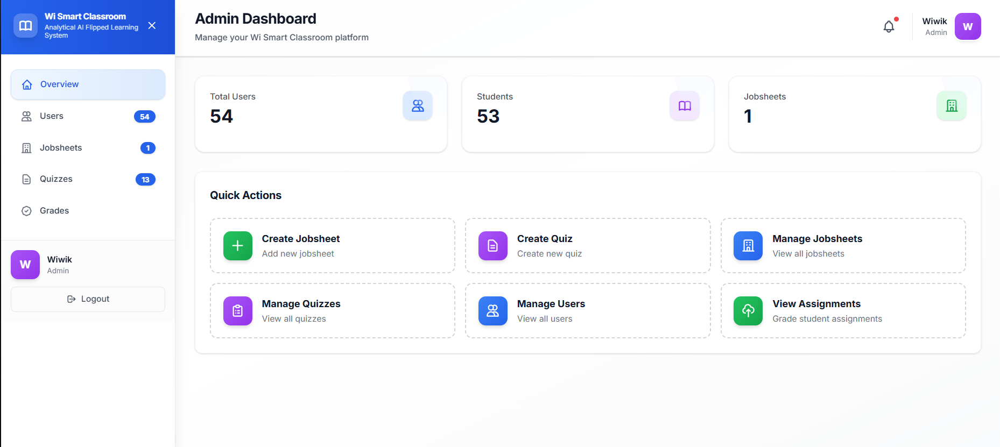

# Learning Management System (LMS) with AI Chatbot



The LMS is a modern educational platform designed for universities and colleges to manage courses, assessments, and learner support in one place. It combines traditional learning management capabilities with an AI-powered chatbot that helps students improve after quizzes by explaining the concepts they missed and guiding them toward better understanding.

## Product Overview

This platform is built to support three main groups of users:

- Administrators who manage the learning environment and oversee platform usage.
- Lecturers who create modules, publish quizzes, review student performance, and monitor classroom progress.
- Students who access learning materials, complete assessments, and receive personalized help when they struggle.

The system is designed to reduce the gap between assessment and learning by turning quiz results into a teaching moment rather than a simple score.

## How the AI Chatbot Works

The chatbot is designed to assist students after they complete a quiz, especially when they answer questions incorrectly. Its workflow is simple and student-friendly:

1. A student submits a quiz and receives their results.
2. The system identifies the questions the student answered incorrectly.
3. The AI chatbot analyzes those incorrect answers in the context of the relevant module content and quiz topic.
4. It explains the correct concept in a clear, supportive way and helps the student understand why the answer was wrong.
5. The chatbot can provide step-by-step guidance, examples, and follow-up explanations so the student can learn from their mistakes rather than simply move on.
6. Students can continue the conversation by asking additional questions such as “Why is this concept important?” or “Can you explain this in simpler terms?”

This makes the chatbot more than a basic FAQ tool. It acts as a personalized tutor that reinforces learning after assessment and improves understanding in a more active and engaging way.

## Detailed Features

### 1. Role-Based Access Control
The platform supports different user roles with tailored permissions. Administrators can manage the system, lecturers can create and supervise content, and students can access only the resources relevant to their learning journey.

### 2. Module and Content Management
Lecturers can organize course content into modules and upload supporting files such as PDFs. This allows students to study using structured learning materials that are directly linked to assessments.

### 3. Quiz Creation and Auto-Grading
The platform supports quiz-based assessment with automated grading. Once a quiz is completed, the system can immediately evaluate student performance and highlight areas where the learner needs more support.

### 4. AI-Powered Post-Quiz Learning Support
After a quiz, the chatbot helps students review incorrect answers by explaining the underlying concepts. This feature turns assessment into an opportunity for guided learning and immediate feedback.

### 5. Personalized Student Assistance
Instead of giving generic feedback, the chatbot offers targeted explanations based on the student’s mistakes. This makes support more relevant and helps students focus on the concepts they truly need to understand.

### 6. Lecturer Dashboard and Analytics
Lecturers can view engagement, performance trends, and assessment outcomes through a dashboard. This helps them identify students who may need extra guidance and refine their teaching approach.

### 7. Student Progress Tracking
Students can track their progress over time and understand how they are performing across quizzes and modules. This encourages self-directed learning and accountability.

### 8. Modern and Scalable Architecture
The platform is built with a modern frontend and backend architecture, making it flexible for future enhancements such as adaptive learning, deeper analytics, and expanded AI features.

## Tech Stack

- **Frontend**: Next.js 14+ (React, TypeScript, Tailwind CSS)
- **Backend**: Node.js + Express + TypeScript
- **Database**: Supabase (PostgreSQL)
- **Auth**: Supabase Auth
- **AI**: Google Gemini API

## Getting Started

### Prerequisites

- Node.js 18+ and npm/yarn
- Supabase account and project
- Google Gemini API key

### Installation

1. Clone the repository
2. Install dependencies:
   ```bash
   # Frontend
   cd frontend
   npm install
   
   # Backend
   cd ../backend
   npm install
   ```

3. Set up environment variables (see `.env.example` files)

4. Run migrations (see `database/schema.sql`)

5. Start development servers:
   ```bash
   # Backend (from backend directory)
   npm run dev
   
   # Frontend (from frontend directory)
   npm run dev
   ```

## Project Structure

```
LMS/
├── frontend/          # Next.js application
├── backend/           # Express API server
├── database/          # SQL schema and migrations
├── ARCHITECTURE.md    # System architecture documentation
└── README.md          # This file
```

## Documentation

- [Architecture Overview](./ARCHITECTURE.md)
- [API Documentation](./backend/README.md)
- [Database Schema](./database/README.md)

## License

MIT
